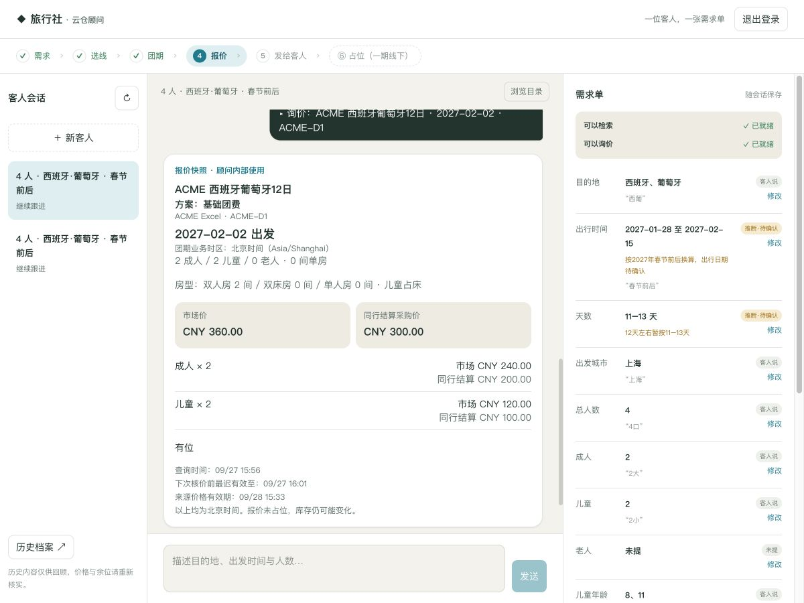
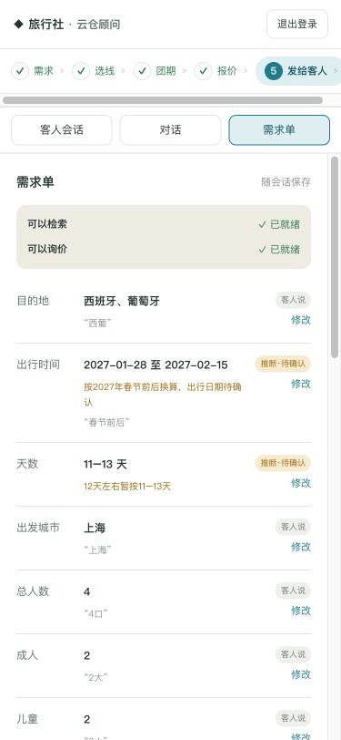

# 顾问工作台重构：实现与验收

日期：2026-09-27。依据 `advisor-workbench-brief.md` 与配套原型实施。
本次项目负责人于 2026-09-27 要求按移动优先修复清单实施；儿童占床沿用 Brief 的有证据推断、显式待确认口径。现有记录无法确定历史首次确认时间，不将其表述为有日期依据的独立确认。顾问修改优先，推断不能覆盖顾问决定。

## 结果与边界

本轮移动优先结果见 [移动端与 ECS 验收](advisor-mobile-acceptance.md)。小屏改为单屏对话、独立会话列表和底部需求单，桌面保留三栏。以下 WP 基线记录保留其原始验证范围。
持久化需求单连接检索、匹配理由、团期、报价、客户分享和线下跟进。
报价直接读取需求单；“4口”不会默认成4成人；影响报价的修改会使旧报价失效。
一期不新增上游占位、订单、付款或库存扣减。

本次复用仓库原有开源 commerce-agents 的 PresentationExtension、ShoppingAgent、
流式卡片、受限 PostgreSQL、报价快照、分享能力和会话租约。未替换 Agent 核心，
也未引入另一套示例应用。主工作在隔离源码副本进行，随后按源文件基线哈希检查回写。

## 新增数据与接口

| 项目 | 行为 |
|---|---|
| `0038_trip_brief` / `conversation_brief` | 会话、组织、用户复合外键；强制所有者 RLS；JSONB 需求、版本、更新时间 |
| GET `/v1/conversations/{id}/brief` | 空旧会话兼容；返回字段、来源、就绪度、阶段与允许操作 |
| PATCH 同路径 | `expected_version`；顾问修改来源为 advisor；冲突 409；忙碌租约拒绝覆盖 |
| POST `/v1/conversations/{id}/actions` | 检索、团期、方案、询价、分享、客人确认、线下备注；请求 ID 幂等重放 |
| 同源前端代理 PATCH | 编辑需求真实经过前端到 API，不仅验证后端单元调用 |

模型 `update_trip_brief` 的 said 引文必须在本轮原话中；inferred 必须有解释；
模型不能标记 advisor。`search_routes` 默认读取需求，临时覆盖不写回。
直接操作持久化简短事件和可恢复 UI，不把目录页塞入模型消息。
分享明文密钥仅即时交给浏览器，模型 notes 和数据库事件不保留；
`TripBrief.share_token` 实际保存分享记录 ID，避免破坏原系统只存密钥哈希的设计。

## 提示词规则迁移

原 domain_search_notes 27 条收敛为 8 条。自然语言语义和事实边界仍保留；
可确定执行的行为由以下代码接管，避免只靠提示词约束。

| 原规则主题 | 当前实现 / 保留位置 |
|---|---|
| 日期必须传入检索、后续城市改变保留日期 | `advisor_actions.search_parameters` 从需求单取日期；`departures_page` 同一窗口 |
| 未写年份、中旬/春节前后、举例国家 | 8条规则中的第2、3条；inferred+hint，不声称已确认 |
| 先查日期再推荐，范围外备选、空结果措辞 | 匹配理由实际窗口最早日期；团期 out_of_window；第3、5条 |
| 关键词不拼人数日期，days/depart_city | 目的地 query 与结构化筛选分离；天数区间硬筛，城市软匹配 |
| 四口不能默认成人；查线不先问房型 | `trip_brief.readiness` 两级门槛、`to_party` 无成人默认 |
| 询价必须成人儿童年龄房型 | 工具 schema 去掉 party；只从保存的需求单转换；缺项拒绝报价 |
| 酒店购物以复核稿为准 | `advisor_matching` 只读适用的已复核稿；无稿/版本不确定返回 unknown |
| 标题、营销描述不能证明行程、适合人群 | 第6条及 brand_voice；未复核只比较已知事实，不猜测附件缺失 |
| 实际日期与标称天数矛盾 | 第7条要求标注待确认；不自行修正源数据 |
| 结果有限、团期下一页、不可断言全平台无货 | 第5条；有界查询与 scope-bound keyset 游标；撤下游标锚点后仍可翻页 |
| 多方案显式选择、WO不是线路、共享库存 | 已展示 ID 与父团期校验；单方案自动，多方案必须选择；复用报价服务 |
| 不展示精确余位 | 只返回 ok/short/unknown/out_of_window；旧数据回顾重新核实 |
| 未查报价不等于没报价，未知不能零价 | 保留 brand_voice，报价快照已知部分/缺项仍由原服务决定 |
| 每轮短结论、一次问一件、推断提醒 | 第4、5条及需求单/报价推断列表 |
| 发给客人、线下操作 | 第8条；客户投影白名单；线下状态不代表系统占位 |

派生提示词在 [advisor/system.md](advisor/system.md)，快照测试比对实际 builder。
通用 Managed Agent 提示词未改动；`scripts/check.py` 校验其原有一致性。

## WP 基线的本地验收

环境：本机回环 API :8769、生产构建 Next :8770、独立 PostgreSQL :55439。
仅 ACME 虚构目录和测试账号。模型为脚本化 FakeClient（按 Brief 的验收方法），
API、认证、RLS、数据库、报价和浏览器操作为真实执行。
**不等于真实模型自由对话、真实供应商接口或线上部署验收。**

已在浏览器走通：

1. 登录 → 默认新客人对话 → “一家4口，春节前后，西葡，12天左右，上海出发，不进购物店”。
2. 需求保存并展示出处；时间/天数标推断；成人儿童未填；可以查询而报价缺项。
3. 查看线路匹配理由与实际团期；未复核购物为待确认，不假称无购物。
4. 输入“2大2小，8岁和11岁，两间双人房”；儿童占床标推断待确认；点团期询价。
5. ACME 测试报价市场价360、同行结算300；年龄与两间房完整进入报价快照。
6. 重启 API/前端并选择原会话，恢复需求与历史卡片；重新询价后生成分享。
7. 客户预览无同行结算价、供应源身份或精确库存；复制给计调含日期人数房型。
8. 标记客人确认、保存线下备注，列表显示已记录线下占位；系统仍未占位。
9. 手机编辑儿童占床为不占床 → “顾问改” → 旧报价失效 → 分享入口收起。
10. 聊天输入“请把当前报价发给客人”，右侧即时出现可用客户链接；新客户页再次核对仅市场价。
11. 375px 页宽与文档宽均375，无页面横向溢出；阶段条可横向滚动。

浏览器检查发现并修复：需求编辑代理缺少 PATCH；历史团期不应继续断言当前人数可满足。
测试另外覆盖权限隔离、版本冲突、动作重放、缺项拒绝、聊天分享密钥不持久化、
购物证据、软匹配排序、全局分页及查询计划的索引路径。
查询计划检查使用 ACME 数据并关闭顺序扫描验证可用索引，不代表生产容量压测。

## WP 基线的检查结果

- 全仓 pytest：2373 passed、2 skipped。两项为原有非加库存演示契约、未配置真实线路标签快照；非云仓数据库跳过。
- 专用 PostgreSQL CI：642 passed、zero skips。
- ruff check / ruff format --check：通过。
- `python scripts/check.py`：通过。
- Next.js 生产构建（webpack）：通过。
- 最终补充分享检查：19 passed；详见本地 `output/advisor-validation/share-final.log`。
- 库存池、库存流水、报价数量和上游调用次数的前后不变由 HTTP 集成用例断言。

完整日志位于隔离副本的 `output/advisor-validation/`，不提交测试凭据与运行数据库。

## 截图

桌面 1200×900（另验证1440宽）：



手机 375×812：



## 部署迁移

本次未改动线上服务或业务库。部署时停止旧 API 和相关写入进程，备份后使用
项目既有受控管理员配置执行：

```bash
warehouse migrate
warehouse grant-runtime warehouse_runtime
```

角色名以部署配置为准。迁移到 `0038_trip_brief` 后，重新构建并启动 API 和顾问前端，
保留 `TOUR_BACKEND_MODE=warehouse` 与内部 API 地址。登录复测、旧会话恢复、需求编辑、
询价和分享检查完成后再恢复流量。不要用本机 ACME 测试账号或测试数据库上线。
