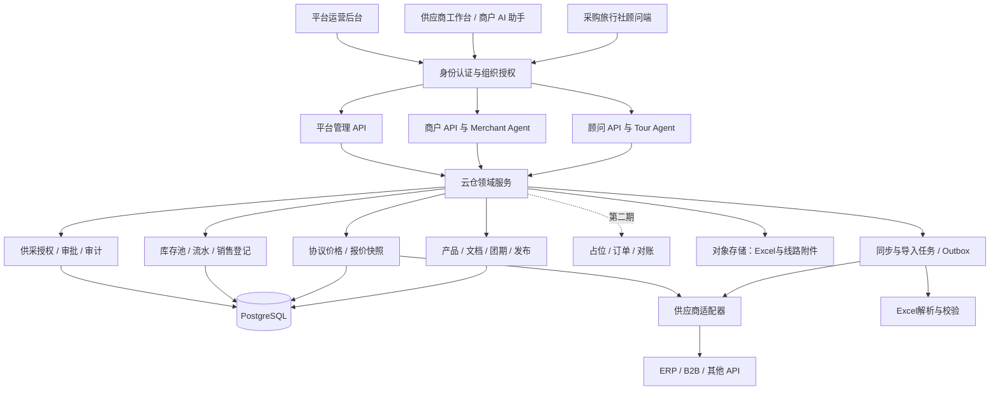
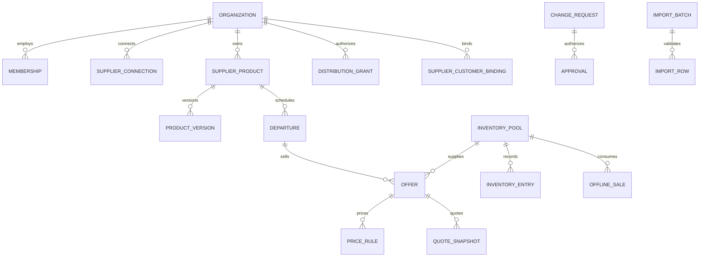

# 旅游云仓后端开发规划

版本：V1.0 · 2026-09-22  
状态：开发规划；业务范围已确认，技术选型和工期为建议，尚未实施。  
依据：当前工作区 `6a7a7053b62845f8dc32eed351f37418965009e9` 及未提交改动；保留现有 Tour 顾问端，结合原仓库 Travel 商户端与 Merchant Agent 结构。

## 1. 项目目标与已确认范围

建设一个由平台运营、多家供应商与多家采购旅行社共同使用的旅游产品云仓。顾问端和供应商工作台使用统一业务服务；云仓通过适配器接入 ERP、B2B、其他 API，以及 Excel 与人工维护的数据。

| 决策 | 已确认内容 | 对实施的影响 |
| --- | --- | --- |
| 第一阶段 | 统一产品、报价与库存查询，预留订单架构 | 不开放顾问占位、下单、支付、退款或自动创建 ERP 订单 |
| Excel 供应商 | 全部由云仓统一管理库存及扣减 | 必须有库存账本、人工销售登记、调整审核和重复登记防护 |
| 运营范围 | 平台模式，多家采购旅行社与多家供应商 | 身份、组织、供采关系、价格授权与数据隔离从第一天建设 |
| 复用原则 | 结合现有商户端结构 | 复用业务接口、工作台布局、Agent 和变更审批模式；替换演示身份与存储 |
| 当前交付 | 完整后端开发规划 | 本次不修改运行中的应用，不迁移数据，不部署新平台 |

第一期的业务闭环：供应商入驻 → 授权采购方 → API 同步或 Excel 导入 → 校验及发布 → 顾问查询和取得报价 → 线下成交 → 供应商登记已售数量 → 云仓库存更新。

**需要落实的运营前提：**Excel 供应商在电话、微信或其他渠道成交后，也必须通过云仓登记销售，或由已授权人员导入销售流水。若存在不入账的并行销售渠道，“云仓统一库存”就不能成立。未完成交接的供应商可保留为导入草稿，不按云仓管理库存发布。

第一期不收集旅客证件等履约资料；销售登记只保存库存扣减所需的团期、人数、渠道、业务参考号和操作人。它不是云仓订单或支付凭证。

## 2. 当前仓库核查与复用边界

### 2.1 已有能力

| 原仓库位置 | 已核实的机制 | 云仓使用方式 |
| --- | --- | --- |
| `examples/tour/storefront-web/lib/api.ts` | 顾问前端调用 Tour API | 保留前端入口，逐步将业务数据切换到云仓 |
| `examples/tour/api/main.py` | 组装 `TourBackend`、Shopping Agent、会话与 ERP 登录 | 拆出身份依赖和业务数据提供者，作为顾问应用层 |
| `examples/tour/api/tour_backend.py` | `StorefrontBackend` 实现，线路、团期、报价、预留和方案流程 | 保留会话、展示与选团逻辑，业务读写迁入云仓服务 |
| `examples/tour/api/erp_client.py`、`http_erp.py` | ERP 协议、字段转换、部门及客户报价语义 | 包装为首个供应商适配器；不得将单 ERP 假设推广到全平台 |
| `merchant-agent/core/merchant_agent/backend.py` | 8 类读取、5 类提议、应用及撤销变更接口 | 实现 `WarehouseMerchantBackend`，复用 Merchant Agent 运行时 |
| `merchant-agent/core/merchant_agent/changes.py` | 提议和执行阶段的限制检查；内存 `ChangeLedger` | 复用校验思路及纯函数，建设数据库变更单与审计流水 |
| `examples/demo_common/merchant.py` | 工作台读取、聊天、变更预览按钮审批与刷新事件 | 作为接口和交互参考；另建真实身份与持久化路由 |
| `examples/travel/api/merchant.py` | 商户 Agent 组装、扩展展示工具、`/api/merchant` 路由 | 作为云仓商户应用的装配范例 |
| `examples/travel/api/mock_merchant.py` | 商户与消费者读取同一底层业务状态 | 将共同状态改为云仓数据库及领域服务 |
| `examples/travel/merchant-web/app/page.tsx` | 工作台导航、助手侧栏、业务页面、变更后刷新 | 新建 Tour 商户工作台，沿用布局和刷新机制 |
| `examples/web-shared/portal/` | `PortalShell`、`AssistantRail`、卡片与概览组件 | 直接复用通用组件，新增旅游团期与供应商管理视图 |
| `examples/travel/api/occupancy.py` | `PresentationExtension` 展示有依据的日历数据 | 借鉴扩展方式，新建团期日历，不复用酒店入住率定义 |
| `examples/tour/api/route_doc.py`、`route_docs.py`、`catalog.py`、`review.py` | 线路文档结构、目录检索、审核与来源管理 | 转为供应商作用域下的版本化文档服务 |
| `examples/tour/api/advisor_memory.py`、`plans.py`、`shortlist.py` | 顾问记忆、方案、清单 | 保留功能，新增采购组织、顾问、案例的隔离键 |

### 2.2 不能直接当作生产能力的部分

1. Travel 商户端当前使用固定 `MerchantIdentity`，会话创建不是完整的组织登录系统。
2. `MockTravelMerchant` 使用演示数据和内存变更账本；重启、多进程与并发审批不能依靠它保证正确。
3. 示例 `apply_change` 先改变账本状态，再修改共享内存。生产实现必须在数据库事务内完成业务更新、流水、审计和结果状态，不照搬执行顺序。
4. 示例业务是酒店房源、入住率和日历房价。旅游线路需要“供应商产品—团期—报价方案—库存池”，不能只把“房源”文案替换为“线路”。
5. 示例 `ChangeStatus` 只有 `staged/applied/discarded`。未来外部系统提交中的 `pending/unknown` 必须新增明确的界面状态，不能映射成已应用。
6. Tour 的 `add_to_cart` 会调用 ERP `create_order`，具有真实交易副作用。第一期需要服务器能力开关、工具白名单和写入拒绝测试。
7. 现有 `RT-数字`、`DP-数字` 是单系统编号，多供应商下必须建立全局 ID 与旧 ID 映射。
8. 现有 ERP 协议未提供独立取消、释放、修改订单和上游幂等键；订单列表还存在登录部门范围限制。这些是当前适配器能力边界，并非所有供应商都会一样。

结论：沿用原仓库的角色接口和商户交互方式，新增一个供两端共享的业务核心；不将 Mock 类扩充为生产库存系统。

## 3. 总体架构



建议采用模块化单体：一套 Python 业务代码、一个 API 应用、独立 Worker 进程、PostgreSQL 和对象存储。顾问端与商户端分别组装 Agent，但调用同一组领域服务。

第一期不引入微服务网络拆分、Kafka 或独立搜索集群。目录先使用 PostgreSQL 结构化过滤及全文检索；中文地名、口岸和现有标签规则保留专用字段。确有语义召回需求后再加向量索引，且检索前必须按组织授权过滤。

### 3.1 模块责任

| 模块 | 负责 | 不负责 |
| --- | --- | --- |
| 顾问应用层 | 登录后的工作台、案例、AI 对话、清单、方案展示 | 直接决定价格、库存、权限 |
| 商户应用层 | 供应商工作台、批量操作、AI 提议、审批展示 | 绕过领域服务写数据库 |
| 平台运营层 | 企业入驻、供采授权、接入健康、异常处理和审计 | 默认查看所有采购方协议价或替供应商确认库存 |
| 产品服务 | 来源映射、版本、团期、发布和可见性 | 将不同供应商的相似产品合并成同一库存 |
| 报价服务 | 按采购组织与出行条件计算或获取报价 | 将目录起价承诺为最终总价 |
| 库存服务 | 云仓管理库存的唯一写入口、流水、并发控制 | 在本地修改外部 ERP 的权威库存 |
| 接入服务 | 字段映射、认证、同步、供应商能力与错误标准化 | 让供应商原始字段渗透所有业务接口 |
| 审批服务 | 固化变更内容、审批身份、版本检查、应用结果 | 将聊天里的“可以”视为通用操作授权 |

## 4. 平台账号、组织与权限

### 4.1 身份模型

平台账号与 ERP 登录解耦。一个 `user` 可加入多个 `organization`，每次会话选择一个当前组织。组织可以拥有供应商、采购方或两种业务角色；权限由服务器校验的成员关系和授权确定。

核心上下文：`actor_id + active_org_id + roles + permissions + request_id`。`active_org_id` 即使由界面提交，也必须验证成员关系；供应商凭据、部门 Token、ERP 客户编号都由后端解析，不能相信浏览器或模型提供的编号。

| 角色 | 主要权限 |
| --- | --- |
| 平台管理员 | 企业审核、平台配置、角色授权、接入治理；敏感数据访问需显式支持授权和审计 |
| 平台运营 | 产品发布审核、导入异常、同步工单；不自动拥有价格和库存修改权 |
| 供应商管理员 | 本企业成员、供采关系、凭据配置、发布及审批 |
| 供应商产品人员 | 本企业线路、文档、团期维护及导入提议 |
| 供应商库存人员 | 本企业销售登记、库存调整提议；按授权执行或提交审批 |
| 采购旅行社管理员 | 本企业顾问和供采关系；不能修改供应商库存 |
| 顾问 | 查询获授权产品与本企业报价，管理自己的案例和方案 |
| 审计人员 | 读取授权范围内的审计记录，不能改变业务数据 |

### 4.2 数据隔离规则

- 产品由供应商组织所有，通过 `distribution_grant` 授权给采购组织；查询同时要求供应商有效、产品已发布、供采关系有效且产品在授权范围内。
- 协议报价以采购组织为边界；甲旅行社不能通过链接、搜索、导出或缓存读取乙旅行社的报价。
- 库存池由供应商所有，可售状态可以对已授权采购方公开；精确余位与库存流水使用不同权限。
- 顾问会话按 `(buyer_org_id, user_id, case_id)` 隔离；供应商助手记忆按供应商组织和操作者隔离。旅客偏好保留在案例中，不自动进入顾问长期记忆。
- 附件下载先验证组织授权，再发短时链接或经过代理；对象存储路径中的 UUID 不能替代授权。
- 后端权限检查为第一道边界，PostgreSQL RLS 为第二道。产品的跨组织授权读取需要专门 policy，不能仅做 `owner_org_id = active_org_id`。
- 应用数据库账号不使用超级用户或 `BYPASSRLS`，必要表启用 `FORCE ROW LEVEL SECURITY`；连接池每个事务用 `SET LOCAL` 绑定上下文并验证回收后不串租户。相关机制依据 [PostgreSQL 行安全文档](https://www.postgresql.org/docs/17/ddl-rowsecurity.html)。

平台认证建议同源 HttpOnly、Secure Cookie、会话轮换、CSRF 防护和组织切换校验；现有 `X-Session-Id` 在兼容层短期保留，随后迁移。后台管理员和凭据管理权限建议支持二次认证。

## 5. 产品、团期、价格与库存的统一模型

### 5.1 基本实体关系



图为主要关系；供采授权和 ERP 客户绑定均有供应商、采购方两个组织外键，具体定义见下表。不同报价方案可以共享一个库存池，避免把成人、儿童或不同价格的同一批名额重复计数。

| 实体 / 拟建表 | 关键字段与约束 | 阶段 |
| --- | --- | --- |
| `organization`、`membership`、`role_binding` | 企业类型、状态、成员角色；同一用户可属于多个组织 | 一期 |
| `supplier_connection` | supplier_org_id、connector_type、credential_ref、scope、capabilities、health | 一期 |
| `supplier_customer_binding` | supplier_org_id、connection_id、buyer_org_id、上游 customer_id、company_id、授权状态；唯一组合，后端维护 | 一期 |
| `distribution_grant` | supplier_org_id、buyer_org_id、产品范围、价目表范围、有效期、状态 | 一期 |
| `external_mapping` | connection_id、entity_type、external_id → cloud_id；外部三元组唯一 | 一期 |
| `supplier_product` | UUID、supplier_org_id、产品代码、名称、目的地、天数、状态、active_version_id | 一期 |
| `product_version`、`document_asset` | 原始文件、内容 hash、解析版本、字段来源、复核状态、发布版本 | 一期 |
| `departure` | product_id、出发日期、返回日期、国际出发口岸、报名截止、成团条件、业务状态 | 一期 |
| `offer` | departure_id、价格方案、服务标准、可见性、inventory_pool_id；是报价与未来成交的对象 | 一期 |
| `price_rule`、`price_list` | 供应商、采购组织/等级、offer、乘客类型、币种、计价单位、有效期、优先级、版本 | 一期 |
| `inventory_pool` | owner_org_id、authority_mode、total、sold、held、blocked、version、verified_at、status | 一期 |
| `availability_snapshot` | 外部资源引用、可用数量或未知、状态、observed_at、expires_at、source_version | 一期 |
| `inventory_entry` | pool_id、操作类型、数量变化、前后版本、业务引用、actor、幂等键；不可原地修改 | 一期 |
| `offline_sale` | supplier_org_id、pool_id、人数、渠道、外部参考号、登记时间、状态；重复登记唯一约束 | 一期 |
| `quote_snapshot`、`quote_line` | buyer_org_id、advisor_id、offer、人数/房型条件、同业价与市场价、费用明细、来源版本、有效期 | 一期 |
| `import_batch`、`import_row` | 模板版本、上传 hash、行级错误、业务主键、差异、预览版本、审批关联、发布结果 | 一期 |
| `change_request`、`approval` | actor、org、完整 diff、base_version、payload_hash、状态、批准人与执行结果 | 一期 |
| `sync_cursor`、`sync_run`、`sync_error` | 每连接和实体的游标、版本、重试、隔离错误与统计 | 一期 |
| `audit_event`、`outbox_event`、`job` | 行为、关联 ID、事件去重、处理租约和失败记录 | 一期 |
| `sales_case`、`saved_plan`、`conversation` | buyer_org_id、advisor_id、case_id、分享权限与版本 | 一期迁移 |
| `reservation`、`order`、`supplier_order`、`reconciliation_item` | 稳定 ID、关联 quote/offer/pool、状态机及对账字段 | 二期；一期完成契约设计，不开放交易路由 |

### 5.2 统一口径

1. `supplier_product` 是某一家供应商的产品。可建立相似线路分组用于比较，但不共享库存或直接覆盖另一供应商的文档。
2. `departure` 表示日期和行程实例；`offer` 表示该团期的售卖方案。第一期限定一个 offer 消耗一个名额库存池；多航段、房间等多资源组合占用列入后续扩展。
3. 国际出发口岸、客户所在城市、国内接驳和联运条件分别存储。保留现有口岸归一化逻辑，不以客户居住城市过滤掉可联运线路。
4. 日期保存业务时区；团期日期使用本地日历日期，截止时间保存 UTC 时间戳和展示时区。
5. 金额使用数据库 `NUMERIC` 与 Python `Decimal`，接口以金额字符串和 ISO 币种返回；不使用浮点库存账本或默认汇率。
6. 缺失价格和余位用 `null + reason` 表达；零库存明确表示无可售名额；未知不能展示成“0 位”或“可售”。
7. 文档已解析、已复核、产品已发布、库存已核实是四个独立状态，不能相互替代。

## 6. 报价服务

顾问必须同时能看到获授权的同业结算价和市场价；客户分享页只输出允许对外展示的市场报价。

报价请求包含 `offer_id`、出行日期、成人/儿童数量、必要的年龄或占位条件、房型与单房差等。采购组织及供应商客户绑定从会话解析，不能通过请求任意指定 `customer_id` 来获得他人价格。

| 项目 | 规则 |
| --- | --- |
| ERP/API 产品 | 调用该供应商报价能力；缺客户映射、部门 Token 或价格权限时返回明确不可报价原因 |
| Excel 产品 | 按云仓已发布价格规则计算；明确成人、儿童占位、单房差、附加费、税费及包含项 |
| 价格优先级 | 建议“采购组织协议 → 授权采购等级 → 供应商标准同业价”；同层冲突拒绝发布；缺价格不跨组织兜底 |
| 目录起价 | 只作检索与展示，标记适用条件、更新时间和是否完整；不是完整订单报价 |
| 有效期 | 取上游报价有效期与本地政策的较短值；上游未承诺有效期时显示“即时查询结果，成交需复核” |
| 快照 | 固化规则版本、授权版本、人数条件、同业与市场明细、缺失项、来源和时间 |
| 缓存 | 至少包括 buyer_org_id、供应商连接、offer、人数条件、价目表版本；授权撤销立即失效 |
| 第一期行为 | 创建报价快照不占位、不创建订单、不扣库存；接口始终返回 `reservation_created=false` |

建议返回结构：

```json
{
  "quote_id": "q_example",
  "offer_id": "of_example",
  "buyer_org_id": "org_example",
  "currency": "CNY",
  "settlement_total": "16000.00",
  "market_total": "18000.00",
  "complete": true,
  "missing_items": [],
  "price_source": "supplier_api",
  "observed_at": "2026-09-22T08:00:00Z",
  "expires_at": null,
  "confirmation_required": true,
  "reservation_created": false
}
```

以上编号及价格均为接口示例。实际报价必须来自规则或供应商，不由模型填充。

## 7. 库存管理与首期扣减

### 7.1 两种权威来源

| 模式 | 适用 | 写入权威 | 查询与成交边界 |
| --- | --- | --- | --- |
| `SUPPLIER_API` | ERP/B2B 自己管理库存 | 上游系统 | 云仓保存快照；到期失效，必要时实时查询；本地不能强改上游库存 |
| `WAREHOUSE_MANAGED` | Excel／无系统供应商 | 云仓库存服务 | 初始库存交接后，各渠道销售都登记云仓；由数据库事务扣减 |

模式在库存池层定义。同一资源不能同时由 ERP 和云仓独立扣减。模式切换必须暂停销售、盘点、核对未完成事项并形成交接记录。

### 7.2 云仓管理库存口径

`可售 = 总名额 total - 已售 sold - 有效占位 held - 不可售 blocked`

第一期 `held=0` 且没有顾问占位入口；该字段及未来状态约束为第二期保留。所有值非负，可售不可为负；即使后台手工操作也不能绕过约束。成人与儿童消耗名额的规则由供应商明确，不能把“人数”直接假设成所有场景的占位数。

支持的首期库存命令：初始化名额、增加/减少总名额、登记线下销售、冲正已登记销售、锁定/解锁不可售数量、停售。减少总名额后不得低于已售与不可售之和；错误销售用关联原流水的冲正更正，不删除旧记录。

一次“登记已售 2 位”必须在同一数据库事务中：验证操作人和库存模式 → 取得/校验版本 → 原子更新库存 → 写销售登记与库存流水 → 写审计和 Outbox → 提交。检查与更新不能分成两个独立事务。

可采用带条件的原子更新：

```sql
UPDATE inventory_pool
SET sold = sold + :units, version = version + 1
WHERE id = :pool_id
  AND owner_org_id = :authorized_supplier_org
  AND authority_mode = 'WAREHOUSE_MANAGED'
  AND version = :expected_version
  AND :units > 0
  AND total - sold - held - blocked >= :units
RETURNING version;
```

影响 0 行必须区分版本冲突、余位不足或无权限，并保证无权限场景不泄露资源存在性。销售登记的业务去重记录和上述更新在同一事务中。相同幂等键与相同请求返回原结果；相同键但内容不同返回冲突。

供应商实际成交超过账面余位时，创建异常工单并冻结该池的可售展示，由有权限人员盘点并调整总名额后再登记；不能静默形成负库存。

### 7.3 Excel 初始交接与持续维护

- 初次导入必须声明库存数字含义：总名额、已售、不可售，或“交接时可售余额”。后者建立新的受管资源边界和基线，不能同时冒充历史总名额。
- 初次交接需供应商确认截止时间、未入账销售及已有预留；未解决的预留可作为明确的不可售数量登记，释放需要来源确认。
- 后续 Excel 更新不得直接覆盖 `sold`、未来的 `held` 或流水；库存变动转为有理由、有基准版本的调整提议。
- 导入预览后若发生销售，审批时版本检查失效，重新生成差异，不能覆盖期间新发生的扣减。
- 界面显示库存权威、最后变更/核实时间、同步状态和销售截止状态；过期团期、停售及过截止时间均不可售。

## 8. 供应商接入与同步

### 8.1 统一适配器契约

建立 `SupplierConnector`，以 `connection_id` 和服务器解析的授权上下文运行。建议首期方法：`capabilities`、`test_connection`、`list_products`、`list_departures`、`get_documents`、`get_availability`、`quote`。按供应商能力选择全量、增量、Webhook 或按需读取，不能强制每家实现全部方法。

| 能力声明 | 首期用途 | 不支持时 |
| --- | --- | --- |
| `catalog_read`、`departure_read` | 目录同步 | 不能作为 API 供应商发布，走人工导入 |
| `availability_read` | 余位核实 | 显示未知和需确认，不编造精确余位 |
| `customer_quote` | 按采购方获取报价 | 用已授权维护的价表，或标记暂不可报价 |
| `incremental_sync`、`webhook` | 降低延迟和调用量 | 分页轮询、限流、游标与周期校验 |
| `hold`、`create_order`、`cancel`、`idempotent_write` | 记录未来能力 | 第一期全部交易调用关闭，不能因上游有能力而自动启用 |

Excel 是受管数据的导入入口，不需要伪装成具有 Token 的远程系统。未来云仓库存的占位与订单由本地领域服务执行。

### 8.2 同步流水线

抓取原始数据 → 保存原始快照及来源版本 → 标准化和校验 → upsert 草稿/生成差异 → 审核策略 → 发布版本 → 发出变更事件 → 更新检索投影与缓存。

- 分页要有完整性标记；本轮接口失败、少页或空响应不能解释为供应商下架所有线路。
- 只有完成的全量同步才允许进行缺失资源核对；下架采用明确状态或确认后的删除标记，不硬删除历史报价依赖。
- 增量使用来源版本或更新时间及稳定游标，处理时区、重叠窗口、重复页和乱序事件；无法比较版本的供应商周期做全量核对。
- 重试仅用于幂等读取，指数退避与抖动，遵守供应商限额；按供应商设并发隔离，单家故障不拖垮全平台。
- Webhook 验签、时间窗、防重放和事件去重；按来源版本拒绝旧事件覆盖新状态。
- 将鉴权失败、权限不足、限流、字段不兼容、商品下架、未知库存分别记录，不统一折叠成“没产品”。
- 库存快照过期即降级；产品文案可继续展示最后发布版本，明确时间；目录同步不覆盖云仓自有库存账本。
- 字段所有权按数据域配置：上游产品事实、平台展示补充、供应商维护字段分开。再次同步不得覆盖平台补充字段，也不能把补充内容冒充上游事实。

现有 ERP 首先使用 `HttpErpClient` 作为适配器内部实现。逐项核对其客户报价、部门权限、团期关联、分页和无交易幂等键的约束；接入测试通过前不宣称支持完整订单生命周期。

### 8.3 建议的初始时效策略

目录 30 分钟、近期团期及外部余位 2–5 分钟、定期完整性校验每日一次，仅作为参数起点；以供应商限流及实际体量调整。报价优先实时获取；禁止让缓存 TTL 延长上游有效期。云仓库存提交后直接读取数据库，异步搜索展示目标延迟不超过 5 秒。

## 9. Excel 导入与线路文档

### 9.1 模板与发布流程

建议模板四个 Sheet：线路、团期、价格、初始库存。供应商代码/组织从登录及导入批次绑定，不允许文件内任意指定别家供应商。

| Sheet | 必要信息 |
| --- | --- |
| 线路 | 供应商产品代码、名称、目的地、天数/晚数、口岸、线路附件、包含/不含事项 |
| 团期 | 产品代码、供应商团期代码、出发/返回日期、报名截止、状态 |
| 价格 | 团期/方案代码、价目表、成人/儿童计价条件、同业价、市场价、币种、附加费和有效期 |
| 初始库存 | 稳定库存池代码、口径、总量/已售/不可售或交接余额、核实时间、交接说明 |

上传 → 文件和模板校验 → 字段映射 → 行级错误报告 → 预览新增/更新/下架/库存调整 → 人工确认 → 原子发布 → 审计回执。

重复文件通过文件 hash 提示，业务上仍以“供应商 + 产品/团期/库存池稳定代码”去重；同内容换文件名不得重复建库存。空单元格默认“不修改”，清空字段用明确标记。缺失行不自动下架。日期序列、时区、小数、合并单元格和多 Sheet 外键均须校验。

上传不执行公式或宏；限制压缩展开大小、总行数和文件类型，避免超大压缩包；导出处理公式注入。外链附件下载做 URL、目标网段、重定向和大小校验，禁止访问内网或云元数据地址。

第一期建议单批上限 5,000 行、20MB，超限提示拆分；实际阈值通过压测确定。上传只是进入草稿，不写线上库存。业务有关联的一个发布单元必须全部成功或全部失败，不能留下已发布产品却没有库存归属的半成品。

### 9.2 文档处理

原 Word/PDF → 原始文件 hash → 异步解析 → 标准化 `RouteDoc` → 与团期及产品字段核对 → 人工复核 → 发布文档版本。

保留原文件、解析器版本、审核者和字段来源；相同文件可复用解析计算，但不能借此绕过另一供应商的读取权限或自动转移审核结论。复核应确认与该供应商产品及版本的绑定。

AI 可协助解析和提示矛盾；价格和库存字段仍需确定性校验与发布。方案、清单引用具体产品和文档版本，后续更新不改写已发出的方案内容。

## 10. 商户工作台与 Merchant Agent 对接

### 10.1 页面与接口职责

| 原商户结构 | 云仓工作台页面 | 所需后端数据 |
| --- | --- | --- |
| HomeView | 经营与待办首页 | 在售产品、待复核、低库存、同步失败、待审批；缺失经营数据标记未接入 |
| PropertiesView | 线路与团期 | 产品版本、日期、价格、库存池与在售状态 |
| OccupancyCalendarCard | 团期库存日历 | 每日出发团期、余位、售罄、截止日期；不套酒店入住率公式 |
| BookingsView | 首期改为销售登记；二期订单中心 | 云仓库存销售流水；外部订单仅在能力和授权成立时展示 |
| ChangePreviewCard | 变更预览与审批中心 | 字段前后值、影响团期、版本、数量/价格影响、审批状态 |
| AssistantPanel / AssistantRail | 供应商 AI 助手 | 工具调用与业务上下文、建议、预览和操作结果 |
| 新增 | 接入配置与同步中心 | 连接健康、能力、授权范围、任务与错误 |
| 新增 | 导入与文档复核中心 | 批次错误、字段映射、差异预览、附件与复核记录 |
| 新增 | 采购方授权与价目表 | 供采关系、可见产品、客户映射、价格范围 |

采购组织管理员另有成员与权限页面；平台运营后台复用通用页面组件，但接口权限与供应商工作台分离。

### 10.2 实现 `WarehouseMerchantBackend`

- `search_listings/get_listing`：供应商产品作为 family，团期售卖方案作为 variants；库存操作落到唯一池，处理共享池去重。
- `get_pricing_context`：返回当前组织可见的价表、版本和成本已知性。未知成本不计算毛利；查询不能跨采购组织泄露协议价。
- `stage_listing_update/stage_price_update/stage_inventory_action`：写持久化变更提议；不得改变在线状态。外部权威库存变更在首期返回明确不可操作原因。
- `get_business_snapshot/query_metrics`：只统计接入范围内的数据。线下销售登记不能冒充平台已收款 GMV；外部数据缺失用 limitation。
- `get_pending_changes/apply_change/discard_change`：委托审批服务，重新检查组织、审批权限、内容 hash、基准版本和字段所有权。
- `stage_promotion/stage_campaign`：第一期关闭相应 Agent 工具；抽象接口如仍需实现，返回 `ChangeNotApplicable`，不能返回假成功。
- `execute_analysis_query`：第一期关闭任意 SQL 分析工具，先提供固定指标接口；后续启用也须只读角色与组织范围校验。
- 新的导入、团期日历、销售登记展示通过 `PresentationExtension` 增加；不把旅游专用规则塞进通用 core。

### 10.3 变更与审批状态机

`DRAFT → STAGED → APPROVED → APPLYING → APPLIED`

支路：`DISCARDED`、`EXPIRED`、`CONFLICT`、`FAILED`；第二期外部写入另加 `PENDING_EXTERNAL/UNKNOWN`。

批准必须绑定 `change_id + payload_hash + base_version`，并有过期时间。内容变化或库存版本变化后原批准不可复用。重新执行不得重复扣库存。批量变更在同一组织、同一明确原子单元内提交；跨外部系统不能承诺数据库式全有或全无。

第一期所有 AI 产生的业务变更均由授权人员在预览界面确认；可按金额、数量或权限配置复核人。手工表单和 AI 使用相同命令服务、幂等键、权限和审计，不建设两套库存写逻辑。

保留 core 的三态 `StagedChange` 作为兼容 DTO 时，仅在语义一致时投影；完整审批状态使用云仓 DTO 和新卡片。特别是排队、冲突或外部未知不能显示成 `APPLIED`。

## 11. API 规划

公共前缀 `/api/v1`；现有 `/api` 顾问接口通过兼容层迁移。所有列表有游标分页、可授权的过滤项和稳定排序；时间用 ISO 8601，金额用字符串，错误有 `code/message/request_id/retryable`。资源不可见统一返回 404，未认证 401，明确无操作权限 403，版本冲突 409，数据错误 422，限流 429。

| 方法与路径 | 功能 | 主要权限 / 约束 |
| --- | --- | --- |
| `POST /auth/login`、`POST /auth/logout`、`GET /me` | 平台身份与当前组织 | 独立于 ERP 凭据；限流和会话保护 |
| `POST /auth/active-organization` | 组织切换 | 校验 membership，更新会话上下文 |
| `GET /buyer/products`、`GET /buyer/products/{id}` | 已授权产品目录与详情 | 发布状态 + 供采授权过滤 |
| `GET /buyer/products/{id}/departures` | 团期与售卖方案 | 严格日期窗口，不混入附近日期结果 |
| `GET /buyer/offers/{id}/availability` | 库存与时效 | 区分云仓权威、外部快照和未知 |
| `POST /buyer/quotes`、`GET /buyer/quotes/{id}` | 创建/读取报价快照 | 当前采购组织、幂等、无库存扣减 |
| `GET /buyer/documents/{id}/download` | 授权下载线路附件 | 版本与组织校验、短时访问 |
| `GET /merchant/overview`、`GET /merchant/products` | 商户经营概览与产品 | 供应商组织作用域 |
| `POST /merchant/products/drafts` | 人工录入产品草稿 | 禁止直接绕过发布校验 |
| `GET /merchant/departures/calendar` | 团期库存日历 | 可限制产品范围和日期窗口 |
| `POST /merchant/imports`、`GET /merchant/imports/{id}` | 上传与任务状态 | 文件限制、组织绑定 |
| `POST /merchant/imports/{id}/validate` | 字段映射与校验 | 模板版本、可重试任务 |
| `GET /merchant/imports/{id}/preview` | 差异和行级错误 | 绑定数据版本；发布转 change_request |
| `POST /merchant/changes`、`GET /merchant/changes/{id}` | 提议及预览 | 人工和 AI 共用命令结构 |
| `POST /merchant/changes/{id}/approve` | 批准并触发应用 | Idempotency-Key、内容 hash、版本及审批权限 |
| `POST /merchant/changes/{id}/discard` | 撤销未应用提议 | 已生效操作通过补偿提议处理 |
| `POST /merchant/sales/drafts` | 线下销售登记提议 | 受管库存池、重复业务号校验；批准后扣减 |
| `GET /merchant/inventory/{id}/ledger` | 库存流水 | 供应商库存权限 |
| `POST /merchant/inventory/{id}/adjustments` | 调整提议 | 原因、证据、expected_version；无直接覆盖 |
| `POST /merchant/connections`、`POST /merchant/connections/{id}/test` | 建立/检测接入 | 凭据权限；响应不回显密钥 |
| `POST /merchant/connections/{id}/sync`、`GET /merchant/sync-runs/{id}` | 触发/查看同步 | 限流、任务状态、只读供应商请求 |
| `POST /merchant/distribution-grants` | 授权采购方及价表 | 双方有效组织、授权范围与撤销审计 |
| `POST /merchant/customer-bindings` | 维护上游采购客户映射 | 双方授权和上游权限验证 |
| `POST /merchant/chat`、`POST /buyer/chat` | Agent SSE 对话 | 绑定组织/身份/会话，工具服务端白名单 |
| `GET /platform/organizations`、`POST /platform/organizations/{id}/review` | 入驻审核 | 平台运营角色 |
| `GET /platform/sync-health`、`GET /platform/audit` | 运维与审计 | 最小授权，不读取无关企业敏感内容 |

新建任务返回 202 和 job_id；“接收任务”不表示业务发布完成。所有写入提议及应用接口支持 Idempotency-Key，作用域至少为组织、动作和资源，记录请求摘要与最终结果。相同键异内容拒绝。

**第一期不注册** `/reservations`、`/orders/create`、支付及退款路由；对兼容顾问接口的交易调用明确返回 `CAPABILITY_DISABLED`。同步 Worker 凭据优先只读，防止被误用于交易。

## 12. 第二期订单扩展预留

第一期只形成契约与 ADR，不提前实现无人使用的交易状态机。报价与库存 ID、销售流水、权限和审计设计应允许后续接入以下流程。

云仓管理库存：报价复核 → 原子占位 → 创建订单 → 确认后将 held 转为 sold → 履约。占位过期或取消释放一次；不能确认时既不自动报成功，也不重复扣减。确认与到期竞态通过条件更新和同一库存事务处理。

外部 ERP：报价复核 → 调用实际支持的创建预留/订单能力 → 记录上游结果 → 查询确认 → 对账。若上游“创建订单”已经包含预留，不再额外扣一遍云仓镜像库存。

`reservation` 建议状态：`PENDING / HELD / CONFIRMED / EXPIRED / RELEASED / UNKNOWN`。订单状态与支付状态分开；上游返回候补必须表达 `WAITLISTED`，不能当成已确认有位。

本地超时不代表供应商没有创建订单。没有上游幂等键时，本地幂等只能防止本平台重复发起，不能消除“发送成功但未记录结果”的窗口；必须进入 UNKNOWN，按部门和关联信息回查，无法唯一确认时由人工处理，禁止盲重试。

一期线下销售登记在二期关联订单时，只建立关联或执行明确迁移，不再重复增加 sold；未来自动释放只处理云仓权威占位，外部占位释放以供应商确认结果为准。

未来订单需增加：采购与供应商订单关联、订单快照、修改/取消能力、履约状态、对账、补偿和客资权限。收付款、授信、结算、发票和佣金作为独立后续范围，不默认包含在“下单”中。

## 13. 代码目录与现有 Tour 迁移

建议保持两个 Agent core 的领域中立性。新增可独立安装的业务包和应用入口，位置如下；均为拟建目录。

```text
cloud-warehouse/
  pyproject.toml
  cloud_warehouse/
    identity/          # 用户、组织、供采关系、凭据引用
    catalog/           # 产品、文档版本、团期、offer
    pricing/           # 价格规则、客户绑定、报价快照
    inventory/         # 库存池、销售登记、调整、流水
    ingestion/         # Excel、文件、行校验、导入预览
    integrations/      # Connector 协议、现有 ERP 适配器、同步
    approvals/         # 提议、批准、版本校验与应用
    projections/       # 顾问/商户读模型、目录索引
    persistence/       # ORM、仓储、事务、RLS
    jobs/              # 同步、导入、解析、Outbox
    audit/             # 审计与事件
  migrations/
  tests/
apps/warehouse-api/    # 真实认证、buyer/merchant/platform 路由
apps/warehouse-worker/ # 独立任务进程，共用业务包
examples/tour/api/
  warehouse_backend.py # Tour 到领域服务的适配，逐步替换 ERP 直连
  merchant.py          # WarehouseMerchantBackend 与 Merchant Agent 组装
examples/tour/merchant-web/ # 沿用 Travel 工作台结构，新增旅游页面
```

目录最终命名在编码前锁定；新 package 纳入 requirements、版本检查、安装和 CI，新增模块同步更新 AGENTS 与 README。应用装配层可导入 Agent 包，领域服务不反向依赖聊天运行时或 FastAPI Request。

### 13.1 迁移步骤

1. 为当前用户和会话确认所属采购组织，建立服务端成员映射；不能仅凭手机号或未验证历史字段批量授权。
2. 为当前 ERP 建供应商组织与 connection；导入外部 ID 映射、产品、文档、团期，保留原始来源。
3. 当前 `_erp_for(session)`、固定 `customer_id` 等拆分为授权上下文解析与报价服务，不再让所有采购方共用初始化账号。
4. 将 Tour 目录、团期、报价读取接到 `WarehouseQueryService`；本阶段关闭 `add_to_cart → create_order`，Agent 的工具、建议和文案同步限定为查询。
5. 原 `RT/DP` 编号只在带旧 connection 上下文的兼容层解析，新多供应商响应使用全局 ID。旧分享链接与方案引用保留映射及版本，不重写成其他供应商产品。
6. 新建商户路由，继续使用原 Merchant Agent core 和原工作台组件，但不暴露演示 `/session` 任意创建身份的入口。
7. 迁移会话、记忆与方案时保留顾问和案例边界；来源不明的历史记忆进入待确认区，不自动参与新会话筛选。
8. 先进行旧 ERP 读路径与新云仓读路径的脱敏差异对照，再按采购组织灰度切换；出现问题回退读取路由，已产生库存流水不得通过恢复旧快照抹除。

## 14. 数据持久化、任务与运行保障

建议技术栈：现有 Python/FastAPI/Pydantic；PostgreSQL；SQLAlchemy 与 Alembic 作为拟选持久化及迁移工具；现有 Next.js 与 web-shared；S3 兼容对象存储或已有 OSS。具体版本在实施 P0 锁定并做兼容验证。

第一期可用数据库任务表和 Worker，暂不强制引入 Redis。业务变更与 Outbox 在同一事务提交；Worker 使用租约、心跳、次数上限和去重处理。`SKIP LOCKED` 仅用于任务认领，不作为绕过库存竞争的手段，参考 [PostgreSQL SELECT 文档](https://www.postgresql.org/docs/14/sql-select.html)。

数据库负责业务正确性，消息投递按“至少一次 + 消费去重”设计；不宣称端到端 exactly-once。缓存和搜索都是可重建投影，不能成为库存及审批的唯一记录。

部署至少区分开发、测试、生产配置与数据。规划沿用公网员工访问方式；新后台通过独立路由或域名访问，均要求 HTTPS 与真实登录。端口、域名、证书归属在实施前确认。

历史部署曾在约 1.6GiB 内存的共享 ECS 上出现构建资源阻塞，此为历史观测，非当前资源测量。不得直接把新增数据库、Worker 和文件解析全部堆到该实例。先复核当前容量；建议起测环境为独立应用节点约 4 vCPU/8GiB、独立数据库与对象存储，最终配置及费用以压测和预算确认，不构成采购指令。

前端和镜像在构建机完成；生产只拉取产物并滚动或蓝绿切换。解析任务单独限流，避免上传文档阻塞报价；外部连接按供应商限额排队。

### 14.1 可观测与备份

- 全链路 request_id、organization_id、connection_id、sync_run_id、change_id、quote_id；日志不记录明文 Token、密码、证件和完整聊天内容。
- 指标：各连接成功率、同步延迟、库存过期比例、报价成功率/延迟、导入错误率、审批冲突、库存差异、队列积压、跨组织拒绝事件。
- 告警：供应商鉴权失败、长期无同步、云仓负库存约束失败、重复销售登记异常、审批应用失败和备份失败。
- 数据库定期备份、按条件启用时间点恢复；对象存储版本控制。上线前实际执行恢复演练，核验恢复后账本、余额、审批和报价快照一致。
- 核心流水按业务及合规要求保留；原文件和个人数据有访问、删除与保留策略。具体期限由运营确认，不假定所有数据永久保留。

## 15. 性能与验收目标

以下为拟定验收基线，用于压测和容量规划，不代表当前系统已达到：50 家供应商、100 家采购组织、1 万条产品、10 万条团期、100 并发查询会话。实际规模不同需重估。

| 指标 | 拟定目标及测量边界 |
| --- | --- |
| 授权目录/团期查询 | 本地云仓数据 p95 ≤ 800ms，不含公网网络与 LLM 生成 |
| 云仓管理库存读取 | p95 ≤ 300ms；成功写入后的权威查询立即反映提交结果 |
| 报价 | 本地规则 p95 ≤ 500ms；外部报价单独计时，设约 8 秒预算并返回明确超时状态 |
| 文件任务 | 上传请求在 2 秒内返回任务编号；5,000 行结构化 Excel 校验目标 60 秒内，不含附件 OCR |
| 发布可见性 | 核心数据事务提交后可读取，目录投影延迟目标 ≤ 5 秒 |
| 可靠性 | 试运营月可用性目标 99.5%；外部供应商异常单独统计，不掩盖自身异常 |
| 恢复 | 拟定 RPO ≤ 15 分钟、RTO ≤ 2 小时；以备份方案和演练结果确认 |

必须通过的业务验收：

1. 两家供应商都使用外部编号 `36`，目录、附件、团期和报价不串数据。
2. 两家采购旅行社查看同一产品，可按授权得到不同同业价；修改 URL、缓存键、分页、导出和 AI 工具参数均不能越权。
3. 当前采购身份可见的 ERP 产品范围不会因平台同步账号权限更大而扩大；未完成销售授权映射的产品不公开。
4. 一个云仓库存池剩 1 位，两人同时登记已售，只有一个成功；另一请求无扣减流水。
5. 同一销售登记重复请求返回同一结果；冲正也不可重复增加库存。
6. Excel 预览后新发生销售，原预览发布失败并要求重算；新销售不被覆盖。
7. 外部库存接口失败返回未知/过期，不能显示旧余位为实时；某家供应商失败不阻止其他供应商查询。
8. 第一期顾问/API/Agent/兼容路径都不能创建 ERP 订单；确认一次查询前后 ERP 订单无新增需在可授权的测试环境验证，不向真实生产系统制造测试订单。
9. 商户 AI 可生成变更预览，未批准时数据库不变；批准版本与内容一致才生效，重放审批不重复执行。
10. Worker 中断重启后可恢复，Webhook 重复或乱序不使旧值覆盖新值。
11. 成人、儿童和其他报价方案共享资源池时，只扣实际名额；无价格、不含费用和未知成本明确展示。
12. 备份恢复后余额可从流水重建；旧会话、分享链接及客户方案仍指向正确组织和版本。

测试分层：领域单测、数据库事务/并发测试、组织权限与 RLS 测试、供应商契约测试、导入文件测试、API 集成测试、真实浏览器角色流程、压力与恢复测试。外部供应商默认录制脱敏回包和沙箱；生产只做已授权读取验证。

## 16. 分阶段开发计划

以 2 名后端、1 名前端、共享测试与产品支持为估算前提，第一期建议安排约 10–14 周；属于规划区间，需以 P0 的接口和数据样本验证重估。第二个 API 适配器复杂度、历史数据质量和供应商配合时间可能延长工期。

| 阶段 | 目标与交付 | 依赖 | 验收闸口 |
| --- | --- | --- | --- |
| P0：契约与原型，约 1–2 周 | 供应商接口能力清单、Excel 样本、身份/授权模型、ERD、OpenAPI 草案、库存口径与 POC | 业务负责人、首批供应商 | 一个真实 ERP 与一个 Excel 样本完成字段映射；采购报价授权可解释 |
| P1：平台基础，约 2 周 | 组织登录、成员/RBAC、RLS、数据库迁移、任务/Outbox、对象存储、审计、商户空壳 | P0 | 两供应商两采购方隔离验收；无演示身份入口 |
| P2：产品接入，约 2–3 周 | 当前 ERP 只读适配、产品/团期、文档复核、Excel 校验预览与发布、同步中心 | P1 | API 与 Excel 均形成已授权可查目录；重复导入和同步失败正确处理 |
| P3：报价与库存，约 2–3 周 | 客户映射、协议价、报价快照、云仓库存账本、销售登记/冲正、审批 | P1、P2 | 同业价隔离、最后一位并发、导入版本冲突、账本重建测试通过 |
| P4：两端整合，约 1–2 周 | Tour 云仓读取、商户工作台页面、Merchant Agent 提议、旧 ID 兼容、交易能力关闭 | P2、P3 | 顾问查询及供应商维护闭环，无第一期交易旁路 |
| P5：试运营，约 1–2 周 | 灰度、恢复演练、限流、监控、错误处理手册、第二供应商适配验证 | P4 | 首批组织签署数据核对结果；性能和安全验收通过 |

部分前后端工作可重叠，因此总工期不是逐行机械相加。上线试点建议至少覆盖：一个 ERP 供应商、一个云仓库存 Excel 供应商、两家价格不同的采购旅行社；第二种 API/B2B 在正式扩大接入前验证适配边界，接口未提供时使用契约模拟并明确未验证。

首期完成定义：顾问用平台账号跨供应商查线、查团期、看授权价格和库存；供应商用真实后台维护产品与云仓管理库存；平台可以审计授权、导入与调整；不存在可被调用的顾问交易接口。

## 17. 主要风险与实施前必备资料

| 风险 | 处理方式 | 负责人 |
| --- | --- | --- |
| “平台账号”与上游“采购客户”对应错误 | 供采绑定显式授权，报价前校验，禁止共享默认客户编号 | 产品 + 接入后端 |
| Excel 供应商线下销售不及时入账 | 初始交接、销售登记责任人、时效提醒与每日盘点；失管资源停售 | 供应商运营 |
| 导入或同步覆盖人工修订 | 字段所有权、版本检查、发布差异与来源保留 | 接入后端 |
| 商户 AI 越权或误修改 | core 约束 + 真实组织权限 + 版本化审批 + 同一领域服务 | 后端 + 测试 |
| 原 ERP 写路径被遗留调用 | 服务端能力开关、工具移除、读写凭据分离、绕过 UI 的拒绝测试 | Tour 后端 |
| 同一团期的不同方案重复计库存 | offer 与 inventory_pool 分离，资源级去重 | 领域后端 |
| 现有 ECS 资源不足 | 独立构建、部署前容量评估、Worker 限制和独立存储 | 运维 |
| 没有完整取消/释放接口 | 一期只读；二期按实际能力设计人工处理与 UNKNOWN 状态 | 产品 + 接入后端 |

编码开始前需收集：首批供应商接口文档与脱敏回包、分页/限流说明、授权方式、客户价格映射、两份真实结构 Excel 样本、库存交接口径、供应商与采购方角色名单、发布审批人、预计规模、部署预算及备份要求。当前缺失这些资料不妨碍架构规划，但会影响适配器和工期承诺。

## 18. 架构决策记录

### ADR-001：以模块化单体建设共享云仓核心

**状态：Proposed；业务方向已确认。**

**背景：**原仓库已经有两端 Agent 接口和商户工作台，现有项目为 Python/Next.js，第一期重点是多组织隔离、只读聚合与 Excel 库存。

**决策：**新增共享云仓领域包及真实应用入口，两端通过适配层使用；API 与 Worker 分进程，业务模块暂不拆微服务。

| 方案 | 复杂度 | 复用程度 | 主要代价 |
| --- | --- | --- | --- |
| 推荐：模块化单体 | 中 | 高，保留两端 Agent 与 UI | 需要明确模块边界和事务规范 |
| 直接扩充 TourBackend 大类 | 前期低、后期高 | 短期高 | 身份、供应商、库存和会话继续耦合，不利于商户共用 |
| 立即拆微服务 | 高 | 中 | 分布式事务、部署与观测成本超出首期需要 |
| 整体换成通用电商平台 | 高 | 有限 | 旅游团期、ERP 授权价和既有 Agent 仍需重做适配 |

**后果：**先用本地事务解决库存和审批一致性；当独立团队、任务负载或隔离需求出现时，再拆接入 Worker 或报价服务。

**行动项：**P0 锁定目录与依赖方向；P1 落地组织上下文与事务；P4 验证两端写入同一业务服务。

### ADR-002：库存按来源确定唯一权威

**状态：Accepted for scope；具体契约待 P0 校验。**

**决策：**ERP 资源仍由供应商负责，云仓管理其授权快照；无系统 Excel 供应商由云仓管理库存与扣减。报价请求不触发扣减，首期销售通过供应商销售登记进入账本。

**替代方案：**把所有上游库存复制后都在本地扣减会形成两个权威来源；所有库存都只存参考数又无法满足用户已确认的 Excel 库存管理目标，故均不采用。

**后果：**供应商必须明确承诺线下销售登记；第二期按两种权威分别接入订单。库存交接与模式切换是业务操作，需要审计，不能只改一列配置。

### ADR-003：平台多组织身份与 ERP 身份解耦

**状态：Proposed。**

**决策：**平台管理组织成员和供采授权，供应商客户编号与部门凭据通过受控映射使用。模型和前端不持有供应商密钥。

**替代方案：**要求每个顾问分别登录每家 ERP 不适合无系统供应商，也难以形成统一授权；所有采购方共用 ERP 账号则会混淆权限和价格。

**后果：**供应商入驻需要授权核对流程；统一登录不意味着统一采购价格。P0 必须验证至少两家采购组织的报价隔离。

## 19. 开源参考与证据

首要参考是当前仓库，其双角色、共享业务接口、展示扩展、主机审批和数据来源约束与目标最贴近。外部开源项目用于校验通用机制，不在本阶段替换现有技术栈。

| 参考 | 可借鉴 | 不直接照搬 |
| --- | --- | --- |
| 当前 `commerce-agents` 仓库 | `MerchantBackend`、`StorefrontBackend`、展示扩展、审批预览、共享状态 | 演示身份、内存账本、酒店/零售库存语义 |
| [Medusa Inventory Concepts](https://docs.medusajs.com/resources/commerce-modules/inventory/concepts) | 产品与库存资源分离，同一资源可支持多个售卖方案 | 电商实物地点与发货模型不能直接等同旅游团期 |
| [Medusa Reservations Lifecycle](https://docs.medusajs.com/resources/commerce-modules/inventory/reservations-lifecycle) | 预留数量独立记录，确认或取消按生命周期转换 | 第一期不因此启用顾问占位；上游 ERP 生命周期要以实际能力为准 |
| [PostgreSQL Row Security](https://www.postgresql.org/docs/17/ddl-rowsecurity.html) | 行级授权补强、数据库角色边界 | 单一 owner 筛选不能覆盖供采授权共享目录 |
| [PostgreSQL SELECT](https://www.postgresql.org/docs/14/sql-select.html) | 行锁和队列任务竞争的处理机制 | `SKIP LOCKED` 不适用于把被锁库存当作不存在 |

本地源码入口：

- [MerchantBackend](../../merchant-agent/core/merchant_agent/backend.py)、[变更校验和内存账本](../../merchant-agent/core/merchant_agent/changes.py)、[商户类型](../../merchant-agent/core/merchant_agent/types.py)。
- [商户演示路由](../../examples/demo_common/merchant.py)、[Travel 商户组装](../../examples/travel/api/merchant.py)、[MockTravelMerchant](../../examples/travel/api/mock_merchant.py)。
- [Travel 工作台](../../examples/travel/merchant-web/app/page.tsx)、[共享 Portal](../../examples/web-shared/portal/)、[日历展示扩展](../../examples/travel/api/occupancy.py)。
- [Tour 后端](../../examples/tour/api/tour_backend.py)、[ERP 协议](../../examples/tour/api/erp_client.py)、[实际 HTTP 适配器](../../examples/tour/api/http_erp.py)、[安全边界说明](../safety.md)。

外部资料于 2026-09-22 核对；原仓库能力按当前源码核实，历史部署状态未在本次重新联网验收。所有拟建表、路径和指标均为规划，不应当作已经实现。
