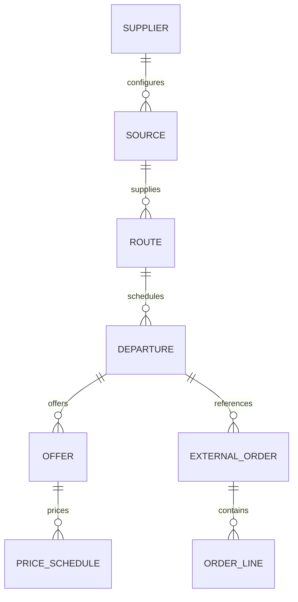

# 商户工作台：线路、团期与订单设计方案

状态：主体结构及独立详情页已实施。占位与预留分别展示上游原值；订单限供应商管理员在配置部门范围内实时只读查询。本文同时包含尚未实现的目标能力，实际交付边界见[商户页面验收记录](merchant-business-acceptance.md)。

本轮范围：梳理三类对象、独立页面、字段与状态；规划 B2B 已有订单的只读接入。云仓下单、占位、确认、取消、支付与结算操作继续关闭。

配套：[可点击页面草图](merchant-workbench-preview.html)。草图使用虚构记录，不连接 API，不保存业务数据；本机仅记住列表的筛选、页码、滚动位置及焦点，便于验证返回体验。

## 1. 已确定的方向与待核实事项

| 项目 | 结论 |
|---|---|
| 商户名称 | 组织显示名改为“国旅环球”；员工身份、登录邮箱、组织 ID 分开管理 |
| 来源名称 | 当前指定 B2B 连接显示名改为“国旅环球B2B-API接口”；连接 ID、凭证绑定和历史原始记录保持稳定 |
| 主要工作页面 | 线路管理、团期管理、订单管理，各自有列表、筛选和详情 |
| 订单范围 | 查看已有 B2B 订单；未来交易能力只预留结构 |
| 库存权威 | B2B 来源由 B2B 管理；Excel 自管来源由云仓管理。订单同步不触发扣减 |
| 占位与预留 | 含义、是否占用可售名额、到期和释放规则待业务确认；先保留独立原字段 |
| 订单权限 | 接口能查到哪些部门、哪些客户的订单，以及员工在云仓能看哪些订单，待逐项验证 |
| 订单补充字段 | 历史单价、计价明细、结算方式、到期日、部分取消及退款字段是否可读，待接口验证 |

当前假设是先解决现有参团线路业务，不新增拼团合并、跨团订单、动态打包或完整财务系统。相同线路、相同发团日期允许存在多个不同团号，不能以“线路＋日期”作为唯一键。

最常见的错误是只拆菜单，仍用同一个商品状态、价格和库存解释三类对象。本方案同时拆分页面读取模型、状态含义与数据来源。

## 2. 业务对象关系

线路是行程内容与销售介绍；团期是有团号、日期、报价方案和库存的发团计划；订单是采购单位按约定条件订购该团期的业务记录。未排团的线路、尚无订单的团期都允许存在。

订单对团期的业务归属应明确。历史订单若暂时找不到云仓团期，仍保留上游团号和原始引用，显示“历史团期待关联”，不丢弃订单、不猜测绑定、不创建可售的虚假团期。

| 标识 | 用途 | 规则 |
|---|---|---|
| 线路编号 / 团号 / 订单号 | 员工识别、检索、与上游核对 | 分别展示，不能互相替代；业务编号不默认跨供应商唯一 |
| 云仓内部 ID | 页面跳转、关系和权限校验 | 不因名称或业务编号修改而改变 |
| 上游 ID | 同步去重、读取详情、追溯 | 保留来源连接和必要的部门作用域；不能按名称匹配 |
| 下单单位 | 上游客户事实 | 保存上游客户 ID 和名称；与云仓采购组织的映射另行确认，名称相同不自动建立权限 |

本阶段每个已有订单按上游所属团期展示。未来跨团组合需求可通过订单明细关联扩展，本轮不实现。

## 3. 字段归属与维护边界

### 3.1 线路

| 字段组 | 字段 | 维护和展示规则 |
|---|---|---|
| 身份 | 线路编号、标题、供应商、来源 | 标题可有经审批的云仓展示补充；原始值单独保留 |
| 基础信息 | 出发地、目的地、天数、晚数、类别 | 上游字段和复核行程分别注明来源，不静默覆盖 |
| 销售内容 | 亮点、特色、简要行程、图片 | 归入线路详情；图片来源及人工维护能力需补齐 |
| 逐日行程 | 日序、当天标题、活动与景点、交通、早餐／午餐／晚餐、住宿 | 复用现有文档解析、字段复核、审批与发布版本；原文件可追溯 |
| 条款 | 费用包含、费用不含、注意事项、购物、自费、儿童及退改说明 | 线路通用条款；团期或方案差异在对应位置明确列出 |
| 参考价格 | 金额、币种、计价单位、适用说明、来源、更新时间 | 可保留上游起价，或明确范围内的团期起价；不等于某客户结算价或成交价 |
| 发布 | 上下架、内容审核情况、版本 | 销售发布与文档审核分开；修改已发布内容须可追溯 |
| 关联汇总 | 团期数量、最近发团日期 | 明示统计范围；取消线路列表的跨团期余位合计 |

线路详情统一提供“基础资料 / 行程内容 / 费用与须知 / 图片与附件 / 发布记录”。现有“线路文档”可保留为批量处理入口，但单条线路内容只保留一套维护和审批机制。

### 3.2 团期

| 字段组 | 字段 | 维护和展示规则 |
|---|---|---|
| 身份与日期 | 团号、所属线路、出发／返回日期、所属部门 | 业务日期按来源配置的时区显示 |
| 销售安排 | 是否关闭、报名截止、关闭原因 | 上游销售事实和云仓主动停售分别记录；缺字段不自动判为在售 |
| 成团信息 | 最低成团人数、确认人数、上游成团结论 | 成团与售罄分开；无签认规则时不自行给出保证成团结论 |
| 报价方案 | 方案编号、名称、服务标准 | 一个团期可有多个方案；当前自管方案共享团期库存，不因新增方案增加名额 |
| 价格矩阵 | 成人、儿童、老人、单房差、附加费；市场价与结算价；适用采购组织／等级；币种及有效期 | 按方案和适用客户展示；无权限或无映射时不能冒充已取得协议价 |
| 库存观察 | 计划人数、可售余位、确认数、预留数、占位数、候补数 | 人数与库存单位可能不同；不直接用人数合计代替占用名额 |
| 库存说明 | 库存权威、观察时间、过期情况、字段缺失 | API 显示上游观察；Excel 显示云仓余额及流水 |
| 行程差异 | 适用线路版本、该团航班／住宿等差异 | 作为目标能力；上游未提供版本绑定时不能假称历史行程已锁定 |

价格矩阵以“方案 × 计价项 × 适用客户／价格层 × 有效期”组织。页面展示已有字段，按当前报价规则选取完整价表，不拼接不同方案或不同层级的最低价格。API 未开放全客户价表时，不通过批量遍历客户来推导价表。

### 3.3 订单（本轮只读）

| 字段组 | 字段 | 规则 |
|---|---|---|
| 身份 | 上游订单 ID、订单号、来源、部门、创建时间 | 同步去重键需根据接口唯一性保证确定，不能仅使用订单号 |
| 关联 | 团号、线路编号／名称、出发／返回日期 | 优先展示订单保存的历史值，当前关联内容另设跳转 |
| 采购方 | 下单单位 ID／名称、门店、经办人 | 下单单位、联系人、游客分别建模；本轮默认不采集无关客资 |
| 明细 | 成人／儿童等数量、成交单价、附加费、调增调减、币种 | 只展示真实上游明细；只有总额时不反算单价 |
| 金额 | 原始金额、调整金额、订单总额、已收、未收、已退 | 保留上游口径；不在语义未核实时套算式覆盖上游结果 |
| 状态 | 原始状态码与文字、已核实的标准状态、预留到期时间 | 未映射值显示上游原文或“待核实”；不因到期自动宣布上游已取消 |
| 结算 | 现付／账期、约定付款日或账期说明 | 结算方式与收款状态分开；未提供时显示“上游未提供” |
| 同步证据 | 最近成功观察、最近尝试、读取范围、同步问题 | 读取失败不覆盖最后成功记录；数据旧时给出明确提示 |

首次同步只能证明“本次读取到的订单事实”。只有上游明确保存并返回的成交快照，才可称为成交时内容；不能用今天的线路内容补成历史成交快照。

## 4. 状态模型与库存规则

| 对象 | 状态维度 | 页面表达 |
|---|---|---|
| 线路 | 云仓发布状态 | 草稿、上架、下架、归档；审核状态另列 |
| 线路 | 上游发布事实 | 已知值按已验证映射展示；未提供则标明未知 |
| 团期 | 销售控制 | 在售、关闭、报名截止；未知和待核实必须可表达 |
| 团期 | 库存观察 | 有余位、无可售余位／售罄、待确认；允许与销售状态同时出现 |
| 团期 | 成团情况 | 上游已成团、待成团或未提供，独立于销售与库存 |
| 订单 | 业务状态 | 保留上游状态；经核实后映射预留、待确认、已确认、候补、取消、完成等 |
| 订单 | 收款／退款 | 与业务状态并列，不用“正常”代表已付款或供应商已确认 |
| 全部 | 数据质量 | 同步失败、过期、关联异常，不混入业务状态 |

上述是目标维度，不表示现有 B2B 已提供所有状态。不能把当前 `published/paused`、上游状态和云仓停售标志简单替换为一套中文标签。

规则：

1. 线路下架拦截新增销售及相关有效报价使用；商户仍可查关联团期、历史订单。上架线路不会自动打开被单独关闭的团期。
2. 团期关闭不改库存，也不自动取消订单。报名截止与预留到期是不同时间，`reserveHours` 不能作为报名截止。
3. 无可售余位不一定等于全部确认售出，可能被占位或预留占用。语义未核实时使用“无可售余位”，保留分项；库存恢复后按已知规则重新展示。
4. 上游缺失一条线路或团期可能是日期窗口、分页、权限或同步问题，不等于上游下架或取消。
5. B2B 可售余位以其有效观察为准，不用当前可见订单反推全团库存。权限范围内订单可能只是全部订单的一部分。
6. Excel 自管库存沿用现有总量、已售、停售量与流水；目前占位量固定为零。不得将停售量直接改名“预留”。未来占位模型需独立评审。
7. 取消可作为次数、人数或流水的历史统计，但不与当前占用余额混加；部分取消与实际释放必须有可靠来源。
8. 报价、订单同步、页面查看不增加任何库存扣减；对账差异只提示，不自动调账。

## 5. 三个页面的布局与交互

保留原 `PortalShell`、组织切换、员工登录、角色控制、助手和审批中心。业务表格改用线路／团期／订单专用读取结构；原 `MerchantBackend` 可以继续用适配层服务助手，不能让它的通用商品结构限制业务页面。

### 线路页

- 筛选：线路编号／名称、供应源、上下架、目的地。
- 列表：线路编号、标题、目的地、天数、参考价及口径、上下架、团期数量、更新时间。
- 详情：行程内容为中心，右上角“查看团期”；不把整张团期表嵌在线路编辑表单内。
- 从线路跳转团期时保留线路筛选，显示可清除的筛选标签。

### 团期页

- 筛选：团号、所属线路、出发日期、销售状态、库存情况、供应源／部门。
- 列表：团号、线路、出发／返回日期、销售状态、可售余位、库存更新时间。
- 详情：基本安排、价格矩阵、库存明细、销售规则、关联订单。
- “查看订单”跳转订单页并按团期筛选；“查看线路”打开对应线路详情。
- 价表与自管库存原批量管理入口可保留，单团操作从团期详情进入同一业务服务。

### 订单页

- 筛选：订单号、团号、线路、下单单位、出发日期、下单日期、订单状态、来源部门。
- 列表：订单号、下单单位、团号／线路、出发日期、人数、总金额／币种、业务状态、结算方式、更新时间。
- 详情：订单摘要、计价明细、收款与结算信息、来源与同步记录。
- 不出现创建、占位、取消、收款、退款等交易按钮。
- 顶部明示“B2B 已有订单，只读”以及实际查询范围。部分部门失败时显示结果不完整，而不是“全部同步成功”。
- API 无能力、当前范围无记录、同步失败、无权限必须是不同页面状态，不能都显示“暂无订单”。

独立页面应有可恢复的地址及筛选参数，刷新、后退和关联跳转保持上下文。组织切换立即清空旧组织的数据和请求；详情访问继续服务端校验。

### 独立详情页与返回行为（已确认）

三类详情统一替换主内容区域，左侧组织与导航保留。列表和详情不同时上下排列，不以居中弹窗或抽屉承载完整行程、价格矩阵或订单。

- 点击线路名称、团号、订单号或“详情”进入独立详情页。使用可复制的真实链接，支持新标签页打开。
- 详情顶部固定显示面包屑、编号、名称和“返回本模块列表”。长行程滚动时仍能识别当前对象，相关线路／团期／订单通过独立链接访问。
- “返回列表”恢复该列表的查询条件、关联筛选、页码、滚动位置和所点击记录的焦点；浏览器后退回到上一访问页面，前进可重新进入详情。
- 详情地址刷新后仍显示同一条记录。直接打开或新标签页打开详情时，返回地址携带的列表筛选与页码仍有效；没有历史滚动位置则从列表顶部显示。
- 不存在或已无权读取的记录显示明确状态，不回落为其他记录。真实系统必须在刷新、返回和跨页跳转时重新校验权限，页面位置恢复不能绕过权限。
- 线路详情提供行程内容等分区入口；跳转分区时标题不能被固定详情栏遮挡。窄屏保留返回入口，宽表格在内容区横向滚动。
- 草图以单文件地址片段实现独立列表／详情视图，例如 `#routes/R-DEMO-001`、`#departures/D-DEMO-001`、`#orders/O-DEMO-001`，查询参数携带返回列表上下文。正式 Next.js 页面使用独立路由，不把演示状态存储当成业务数据持久化。

侧边抽屉仅作为后续可选的快速摘要入口；本轮不增加两套详情界面。居中弹窗用于简短确认操作。

## 6. 已有订单接入方案

### 6.1 能力核实

现有 `HttpErpClient.list_orders` 只取第一页及登录部门，详情读取也没有显式部门参数；`TourWarehouseConnector` 的白名单尚不包含订单列表和详情。新能力不能直接把旧函数暴露给商户页面。

先在授权范围内确认：列表分页规则、可读部门、订单归属、详情作用域、状态码、历史保留期、日期筛选语义、返回金额与结算字段、接口限流。不能因能查某条订单就推断账户有商户全部订单权限。

### 6.2 读取与同步

1. 以已配置的连接及经核实授权部门遍历分页，保留供应商冷却约束与读取限制。去重、页数上限和停止原因明确记录；达到保护上限只能报“未完成”，不能报完整成功。
2. 先同步订单摘要，再按受控范围读取必要详情。列表为空或某部门失败均不删除旧记录，不推断订单取消。
3. 接口只有创建时间筛选时，不能用“上次同步后创建”覆盖旧订单后续取消、收款等变化；需重查未终结订单并制定历史复查窗口。具体频率按真实容量与限流确定。
4. 记录最新成功观察与有业务字段变化的版本，失败尝试单独记录。重复读取不重复创建订单或库存流水。
5. 历史订单独立于在售目录窗口保存；团期未关联时可查看上游事实，禁止串联到同名团期。

### 6.3 数据结构建议（尚未迁移）

| 概念 | 职责 |
|---|---|
| 外部订单当前记录 | 来源身份、上游订单号、当前已观察事实、关联状态、观察时间 |
| 外部订单明细 | 上游实际提供的数量、单价、费用项；缺失可空 |
| 外部订单观察版本 | 业务事实变动和来源证据，字段白名单，避免保存无关联系人／游客信息 |
| 订单同步批次／部门范围 | 页数、数量、覆盖范围、完整性、失败与重试 |

表名和迁移编号在实现阶段确定。该读取模型不能强塞入现有二期 `OrderSnapshot`：后者要求云仓报价、方案和交易作用域，而历史 B2B 订单未必具有这些关联。以后通过显式来源引用关联两类记录，不伪造报价或订单成交时间。

### 6.4 权限

商品分销授权不等于订单查看权限。先提供供应商组织内经授权员工的订单读取；产品编辑或库存管理角色不自动获得全部客户及财务数据。

需定义独立的订单读取权限，并明确金额和联系人字段权限。采购方未来只能在核实的客户映射与订单权限下查看本单位订单，本轮不随商户页面改造自动开放顾问端订单。

## 7. 接口与代码衔接建议

拟议只读接口族如下，具体命名在实现时与当前路由核对；这些地址目前不表示已可用：

| 接口 | 职责 |
|---|---|
| `/v1/merchant/routes`、`/routes/{id}` | 线路分页与完整详情 |
| `/v1/merchant/departures`、`/departures/{id}` | 可直接进入的团期分页与详情，支持线路过滤 |
| `/v1/merchant/external-orders`、`/external-orders/{id}` | 已有上游订单列表与详情，支持团期过滤 |

现有报价方案、销售规则、文档、展示补充、价格及库存服务继续复用；所有写入沿用审批与审计。服务端分页后再取当前页所需关联数据，避免为每条线路读取全部团期和订单。

新增只读订单能力需要专用连接能力声明及最小范围配置；继续拒绝订单创建等交易路由，不扩大适配器的上游写权限。既有订单预留 ADR 要补充“外部订单读取”边界，不能把读取上线写成交易上线。

## 8. 实施顺序与验收

以下是评审后的建议顺序，不是本轮已经执行的变更。

| 步骤 | 内容 | 验收 |
|---|---|---|
| 1 | 核实字段、状态、订单读取范围 | 原字段→业务含义→展示词有逐项映射，未知项有明确处理 |
| 2 | 分离线路与团期专用接口、独立页面 | 可独立检索；线路与团期相互跳转；原助手与审批可继续使用 |
| 3 | 整合线路详情、团期报价与库存详情 | 行程及来源可追溯；参考价／报价／成交价不串用；不重复建设审批 |
| 4 | 接入已有订单只读同步和页面 | 多页、多部门、失败、过期、历史未关联和权限隔离均验证 |
| 5 | 组织与供应源显示名调整、回归与部署 | ID 和绑定稳定；用户验收后同步 ECS，报告实际部署范围 |

必须覆盖的业务验收场景：

- 一条线路多个团期，同一天多个团号；零团期线路、零订单团期。
- 列表第二页带筛选进入独立详情，刷新详情、返回列表、浏览器后退／前进及新标签页打开后，对象和列表上下文正确；详情不再出现在列表下方。
- 独立检索三种编号，关联跳转不串供应商、部门或采购单位。
- 线路下架不删除历史团期及订单；重新上架不解除单团关闭。
- 有余位但关闭、无可售余位、上游销售状态未知、库存过期分别表达。
- 同团多方案共享库存；未选择采购组织时不展示虚构协议价。
- 上游订单分页超过一页，授权多部门，同编号不同来源，部分部门失败。
- 已有订单更新、部分取消、未知状态、总额无单价、结算方式缺失、历史团期缺失。
- 反复同步订单没有新扣库存；无订单权限员工、跨组织和猜测 ID 均被拒绝。
- 所有订单写操作保持关闭；没有把今天观察的数据标成已验证的成交时快照。

## 9. 参考与取舍

- 当前实现：`examples/tour/merchant-web/app/page.tsx`、`components/views.tsx`、`cloud_warehouse/merchant.py`；线路与团期已落独立表，但页面适配为 Listing／variants。
- B2B 契约：[`erp-contract.md`](../../examples/tour/docs/erp-contract.md)；实际读取缺口见 `http_erp.py` 的 `list_orders/get_order` 与 `warehouse_connector.py` 白名单。本轮未重新调用真实订单 API。
- 原框架：继续使用 `examples/web-shared/portal/Shell.tsx` 和原 Merchant Agent；领域规则由云仓确定性服务负责，助手不决定价格、库存或权限。
- 通通游本地源码：`ProductLine`、`ProductCal`、`ProductCalPriceSet` 和 orderplatform 的 `Order` 分别表达线路、团期、渠道价、订单。借鉴字段归属和并行状态，不引入其跨库部署及整套交易流程。
- Voyant：[官方项目](https://github.com/voyant-travel/voyant)与本地 `Voyant_CN/packages/bookings/src/schema-items.ts`。借鉴订单明细和历史快照分离；本轮不替换技术栈，不照搬其模块权限或交易生命周期。

参考项目提供设计依据，不替代国旅环球接口的字段及状态核实。
